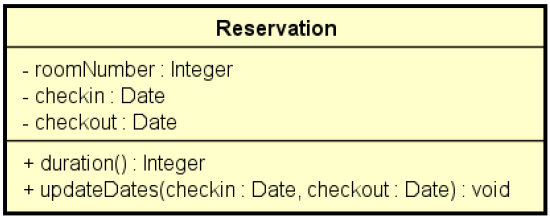
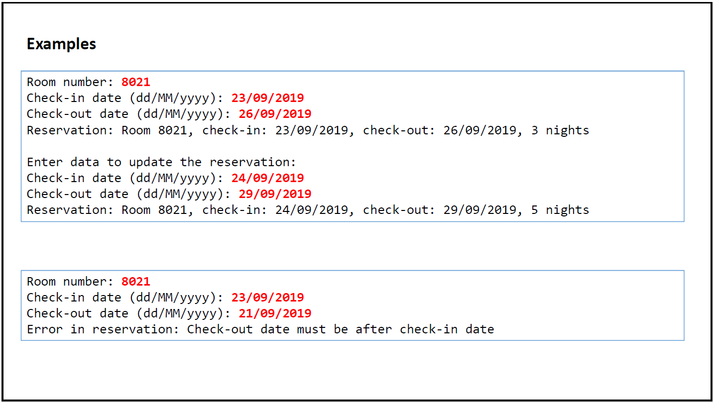
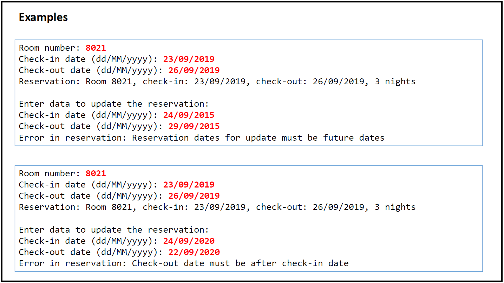

# Tratamento de Exceções
Exemplo didático para demonstrar o uso de Exceções (try-catch) e exceções personalizadas.

Fazer um programa para ler os dados de uma reserva de hotel (número do quarto, data de entrada e data de saída) e mostrar os dados da reserva, inclusive sua duração em dias. 
Em seguida, ler novas datas de entrada e saída, atualizar a reserva, e mostrar novamente a reserva com os dados atualizados. O programa não deve aceitar dados inválidos para a reserva, conforme as seguintes regras:
 - Alterações de reserva só podem ocorrer para datas futuras
 - A data de saída deve ser maior que a data de entrada

<h3> Exemplo 1 </h3>

<h3> Exemplo 2 </h3>

